# Instalación de Python
Esta es una pequeña guía de instalación de Python (Conda), git, y VS Code para los sistemas operativos Windows y distribuciones Linux (Ubuntu o basadas en Ubuntu, como Linux  Mint).

## Conda

Este curso emplea la distribución y entornos de desarrollo de [Conda](https://www.anaconda.com/download/success). 

Existen dos versiones del instalador: Anaconda y Miniconda. La diferencia principal entre ambos es que Anaconda incluye por default un entorno base más completo además de una interfaz gráfica que provoca que el instalador pese alrededor de 1GB, mientras que Miniconda solo tiene un entorno base básico que solo permite crear y administrar nuevos entornos, por lo cual pesa apenas unos 90MB. Por conveniencia y por motivos didácticos, descargaremos la versión Miniconda, señalada con el siguiente texto:


### Para Windows

1. Descargar el instalador gráfico 

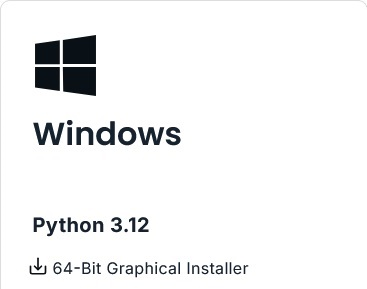

2. Una vez descargado, se ejecuta el instalador.

3. Al preguntar para que usuarios debe instalarse, dejar activado "Just me" como se ve en la imagen

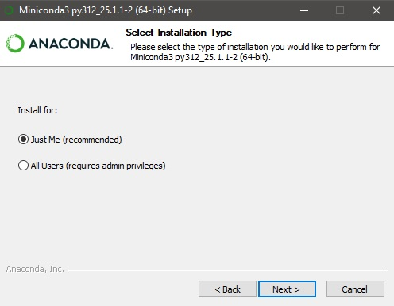

4. Al preguntar la ruta de instalación, es recomendable dejar la ruta default como se ve en la imagen. 


Si tu nombre de usuario contiene un espacio, como por ejemplo "Antonio Rivera", es recomendable entonces cambiar la ruta de instalación como se muestra en las imágenes usando la opción "Browse..."


5. Al llegar a esta ventana, activar todas las opciones. 

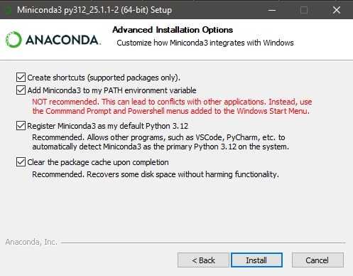

Estas opciones son importante por las siguientes razones:
* La primera opción crea el acceso directo en el menu de inicio de Windows a el cmd y el Powershell que inician conda.
* La segunda opción permite que VS Code y otros editores detecten automáticamente los entornos de desarrollo que vamos a crear. Si la advertencia causa mucho "ruido", puede desactivarse pero iniciar los entornos de conda requiere hacerse manualmente. Esta opción es útil si se tiene otro software, como Blender, que necesite su propia versión de Python.
* Detecta la versión del entorno base como la default del sistema.
* La cuarta opción libera el cache después de la instalación, muy útil si se esta experimentando y se reinstala Miniconda o Anaconda varias veces por cualquier razón.

6. Continuar y dejar que la instalación termine, cerrar la ventana de instalación desactivando las opciones finales que solo son un pequeño tour de conda.

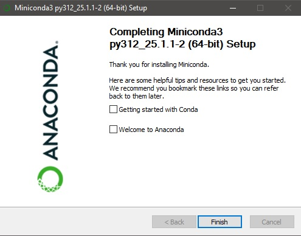

7. Para comprobar que todo este en orden, iniciar el Powershell de conda desde el menú de inicio


8. Checar que en efecto todo este correcto ejecutando Python en este Powershell y corriendo alguna línea sencilla


### Para distribuciones Linux

1. Descargar el instalador de línea de comandos (el primero para la gran mayoría de usuarios) 

2. Al terminar de descargar, abrir un terminal en la ruta donde está el archivo y ejecutar

```bash
bash ./<nombre_del_archivo>.sh
```

donde

```bash
<nombre_del_archivo>
```

es el nombre correspondiente que tenga el instalador.

3. Una vez ejecutandose el instalador, mantener oprimido *enter* hasta que te pregunte si quieres instalar 

## Git

[Git](https://git-scm.com/downloads) es el software de control de versiones de proyectos más comúnmente empleado, con una gran compatibilidad de software de terceros que van desde los repositorios en línea como GitHub, GitLab y Azure, y editores de texto como VS Code o PyCharm. 

Veremos como instalarlo tanto para Windows como distribuciones Linux

### Para Windows

1. Descargar el instalador (de 64 bits para la mayoría de los usuarios) del link [Git Descarga](https://git-scm.com/downloads/win)

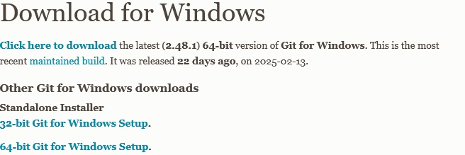

2. Una vez descargado se ejecuta el instalador

3. Al preguntar por la ruta de instalación, dejar la default

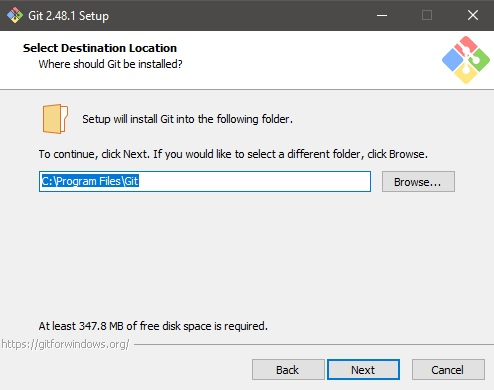

4. Al preguntar por los componentes, activar la penúltima y antepenúltima opción

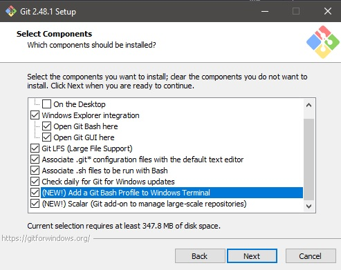

5. A continuación hay una serie de pantallas con varias opciones a escoger, aquí es importante dejar seleccionadas **TODAS** las opciones default. Se dejan las capturas de pantalla con estas opciones para revisar y corregir en caso de algún accidente

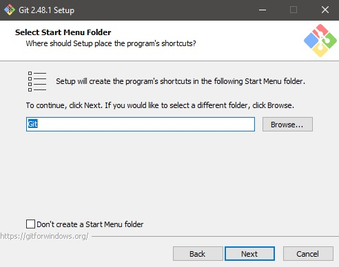

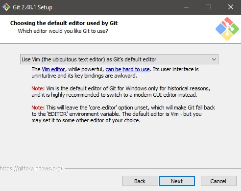

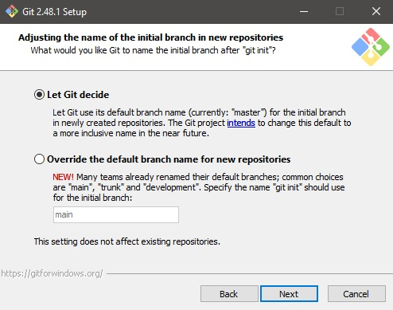

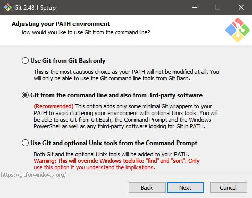


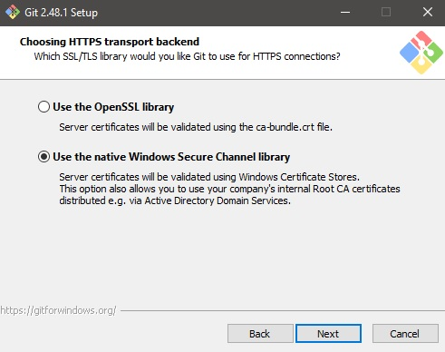

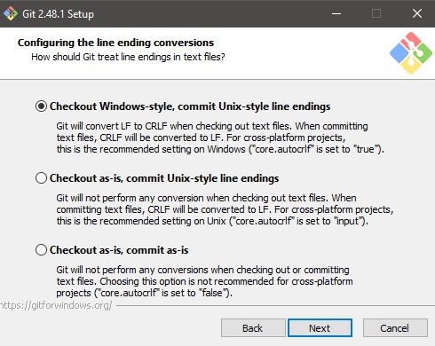

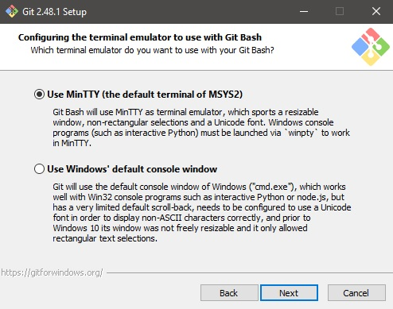

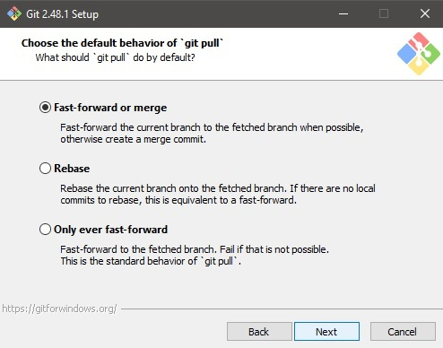

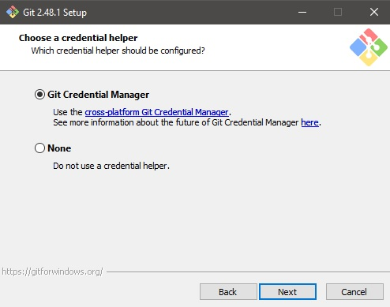

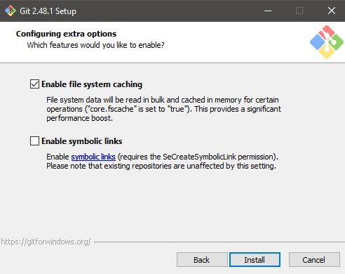

6. Al terminar, simplemente dejar que se complete la instalación y salir

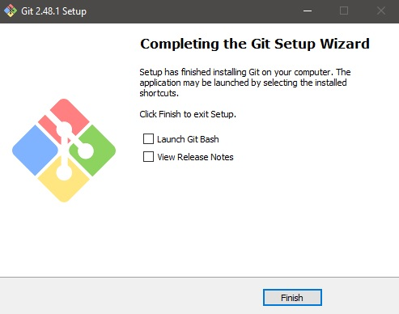

### Para Linux

El proceso en Linux (para distribuciones basadas en Ubuntu/Debian) es muy sencillo, simplemente ir a la terminal y ejecutar

```bash
sudo apt install git
```

## Visual Studio Code o VS Code 

**No confundir con Visual Studio, ese es otro software**

[Visual Studio Code](https://code.visualstudio.com/) es un editor de textos (no confundir con procesador de textos, como Word o Google Docs), de código libre (en el 99% de todos sus componentes) y probablemente el más utilizado en la industria actualmente. Su fortaleza y popularidad radica principalmente en su fácil empleo, su amplia extensibilidad y configuración, y el como integra las herramientas de software como son el control de versiones (git), detección automática de entornos de desarrollo (conda, pipenv), así como debuggers y unit testers.

A continuación veremos su proceso de instalación.

### Para Windows

1. Descargamos VS Code para Windows 

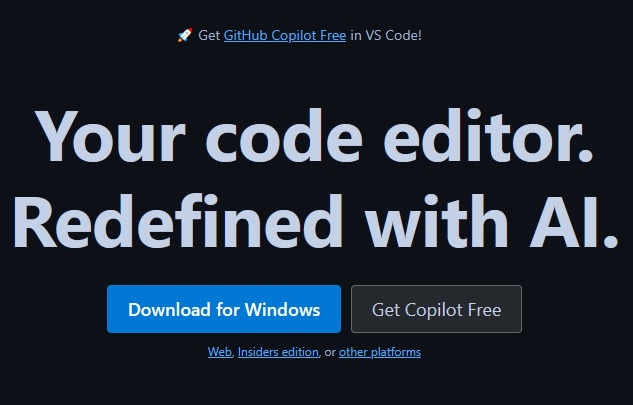

2. Ejecutamos el instalador

3. Damos la ruta de instalación como se ve en la imagen

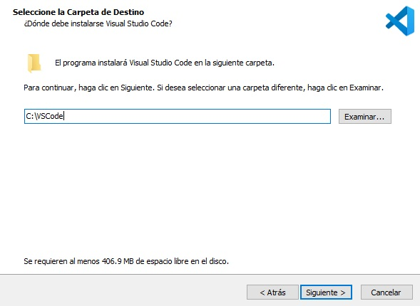

4. Cuando lo pregunte, seleccionamos las siguientes opciones


5. Terminar la instalación

### Para Linux

1. Descargamos VS Code para la distribución Linux que estés usando: para basadas en Ubuntu/Debian, el archivo .deb; para basadas en Fedora/Red Hat, el archivo .rpm.


2a. Si tu distribución ya tiene un instalador gráfico de paquetes, simplemente hacer clic e instalar.

2b. Si tu distribución no tiene un instalador gráfico de paquetes, seguir las instrucciones según tu distribución de la página oficial [Instrucciones para instalación en Linux](https://code.visualstudio.com/docs/setup/linux#_install-vs-code-on-linux)

__________________________________________________________

Con estas tres piezas de software correctamente instaladas en el equipo, ya es momento de empezar a trabajar en nuestro **flujo de trabajo**.

## Creando entornos de desarrollo con Conda

### ¿Qué es un entorno de desarrollo?

Python, así como muchos otros lenguajes de programación, cuenta con un universo de bibliotecas y paqueterías que ayudan al desarrollo de software ya que evita que el desarrollador deba "reinventar la rueda" cada que se encuentra con un problema que ya ha sido resuelto antes. 

La solución inmediata que ofrece el lenguaje es instalar estas paqueterías empleando **pip**, sin embargo, algo que no dicen (o que llegamos a ignorar) es que si se hacen estas instalaciones mediante el flujo de trabajo usual, que es instalar Python y luego instalar las paqueterías con pip, es que se instala en el *entorno global*, es decir, que afectan a todo nuestro equipo. Esto no es un problema si solo se instalan pocas paqueterías pero al ir trabajando en diversos proyectos, estos requieren que se instalen una gran y diversa cantidad de paqueterías, muchas veces conflictuando entre si, y ocasionando serios desastres en un futuro que es más cercano de lo que se puede imaginar.

Para evitar estos problemas, se crearon los **entornos de desarrollo virtuales**. Para entender fácilmente lo que es un entorno de desarrollo virtual, imagina lo siguiente: 

Tienes un taller (tu equipo) donde solo puedes tener una version por cada herramienta que uses, este tu entorno de desarrollo global; un día te llega un nuevo trabajo que requiere un martillo diferente al que usualmente usas, como no puedes tener dos martillos en el taller y no puedes deshacerte del viejo martillo porque lo usas para otros trabajos más frecuentes (como pueden ser tareas usuales que realiza tu sistema operativo), optas por crear un entorno de trabajo virtual, que en este caso puedes considerarlo como una caja de herramientas aislada del resto del taller y que solo se abre (activa) cuando te dedicas a este trabajo en específico. De este modo, puedes tener los dos martillos sin ningún tipo de problema o conflicto. 

Así, los entornos de desarrollo pueden virtuales pueden considerarse como cajas de herramientas armadas para un trabajo en concreto y que solo se activan cuando es necesario.

### Además de Conda, ¿Qué alternativas se tienen y cual usar?

Existen varios creadores y administradores de entornos de desarrollo para Python. En este curso nos vamos a enfocar en Conda pero existen otros como [Pipenv](https://pipenv.pypa.io/en/latest/) y [Poetry](https://python-poetry.org/). ¿Cuál es el mejor o cuál debería usar? La respuesta es muy sencilla: el que más te agrade (o le agrade a tu equipo de proyecto) para proyectos nuevos y en el caso de proyectos que ya llevan tiempo en desarrollo, el que se esté usando. 

Hace algunos años Conda ofrecía ciertas ventajas sobre los demás pero conforme estos administradores han ido mejorando, realmente no hay diferencia significativa para Python, la única diferencia actual que todavía es considerable es que Conda puede crear entornos que incluya paquetería de lenguajes que no son Python, tal es el caso de R, C/C++ y FORTRAN. Con esto, si llega algún proyecto que requiera incluir otros lenguajes, Conda es buena opción.

### ¿Cómo creo y administro entornos de desarrollo para Python empleando Conda?