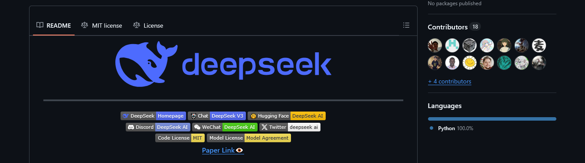
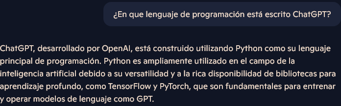

# Introducción a Python

## ¿Qué es Python?

* Es un lenguaje de programación de propósito general
* Es un lenguaje de *alto nivel*
* Es un lenguaje (principalmente) interpretado
* Es software libre
* Es dinámicamente tipado, o que tiene tipaje dinámico
* Es fuertemente tipado, o que tiene tipaje fuerte
* Es multi-paradigma
* Enfocado en la lectura y rápido desarrollo por humanos (pero nada evita que puedas escribir scripts, notebooks, módulos y paqueterías que nadie entienda)
* Es *garbage collected*
* Con *baterías incluídas*

## Criticismo que ya no es válido desde hace varios años

* *Python es un lenguaje lento (comparado con C o FORTRAN)*. 

Python es lento si se emplea mal. Por lo regular quien argumenta que el lenguaje es lento convenientemente trata de probar su punto creando un ciclo for que itera más de 10000 veces para hacer una simple tarea (como encontrar el máximo en un arreglo/lista de números) y lo compara con C o FORTRAN, ignorando completamente que el ciclo for en Python tiene un comportamiento distinto al resto de lenguajes. Python ofrece una multitud de herramientas para realizar ese tipo de tareas sin necesidad de un ciclo for, que son virtualmente igual de rápidas en ejecución que C o FORTRAN, pero mucho más rápidas de escribir en Python.

Y hay que ser humildes: Al creador de cierto lenguaje de programación lo criticaron en su momento en su propio espacio de trabajo cuando sus colegas argumentaron que su creación no era útil ya que a nadie le gustaría ver como su proyecto se ejecuta más lento a que si lo escribiera directamente en lenguaje ensamblador o binario. ¿Cuál era este lenguaje? FORTRAN

* *Los espacios en blanco en la sintaxis es mala idea*

Aunque se pueden encontrar situaciones donde los espacios en blanco en efecto pueden crear problemas, esto esta resuelto desde hace varios años gracias a la gran cantidad de editores de texto (y a sus configuraciones) que existen actualmente que permiten manejar sin problema alguno los espacios en blanco en la sintaxis de Python (y otras piezas de código, como lo son los archivos .yaml). 

* *Python no te deja pensar*

Gracias al universo de bibliotecas de Python, es muy común el siguiente chiste

```bash
import solution
```

Lo cual efectivamente, muy frecuentemente es todo o la mayor parte de lo que se necesita para solucionar un problema. Sin embargo, recordemos que en general estamos hablando de programación: si una solución existe (podemos ser filosóficos aquí), es muy probable que existan más soluciones, algunas más rápidas y otras más precisas, y dependiendo de la tarea asignada, se puede optar por una o la otra.

En un ejemplo claro y reciente de esto, tenemos [DeepSeek](https://github.com/deepseek-ai/DeepSeek-V3), no solamente buscaban ser otra implementación de un modelo de IA más, buscaron como implementarlo para correrlo en equipos de pocos recursos y así **ganarle** a OpenAI, ¿Y qué tiene que ver esto con Python? Solo basta con revisar en que lenguajes están principalmente escritos Deepseek y ChatGPT





* **¡Python es un caos!, ¿Cual usar, Python 2.X.X o Python 3.X.X?**

Cuando se lanzó Python 3 hubo demasiados conflictos ya que el lenguaje sufrió una serie de cambios que rompieron la compatibilidad con demasiados proyectos que en ese entonces estaban escritos en Python 2.X.X. Durante años esto generaba fuertes discusiones pero ya no más, desde el primero de enero del año 2020, Python 2.X.X detuvo su desarrollo y prácticamente ningún proyecto serio que siga en desarrollo o mantenimiento usa Python 2.X.X. Así que diganle a su amigo
 las más recientes [noticias](https://pythonclock.org/), ya solo se usa Python 3.X.X.

