# Instalación de Python
Esta es una pequeña guía de instalación de Python (Conda) y git para los sistemas operativos Windows y distribuciones Linux.

## Conda

Este curso emplea la distribución y entornos de desarrollo de [Conda](https://www.anaconda.com/download/success). 

Existen dos versiones del instalador: Anaconda y Miniconda. La diferencia principal entre ambos es que Anaconda incluye por default un entorno base más completo además de una interfaz gráfica que provoca que el instalador pese alrededor de 1GB, mientras que Miniconda solo tiene un entorno base básico que solo permite crear y administrar nuevos entornos, por lo cual pesa apenas unos 90MB. Por conveniencia y por motivos didácticos, descargaremos la versión Miniconda, señalada con el siguiente texto:

### Para Windows

1. Descargar el instalador gráfico 

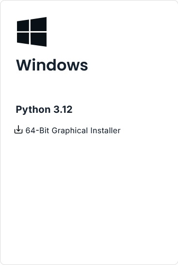

2. Una vez descargado, se ejecuta el instalador.

3. Al preguntar para que usuarios debe instalarse, dejar activado "Just me" como se ve en la imagen

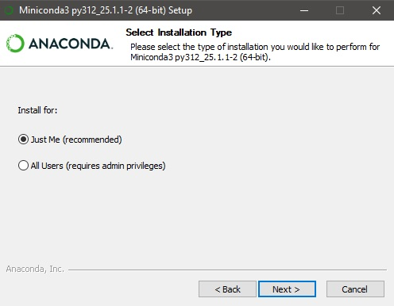

4. Al preguntar la ruta de instalación, es recomendable dejar la ruta default como se ve en la imagen. 

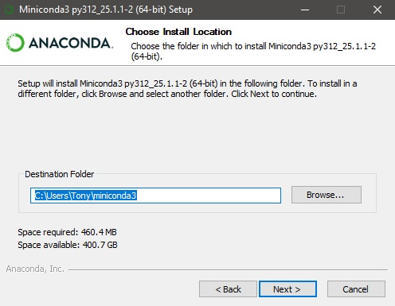

Si tu nombre de usuario contiene un espacio, como por ejemplo "Antonio Rivera", es recomendable entonces cambiar la ruta de instalación como se muestra en las imágenes usando la opción "Browse..."

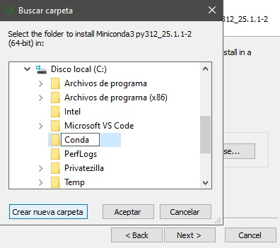

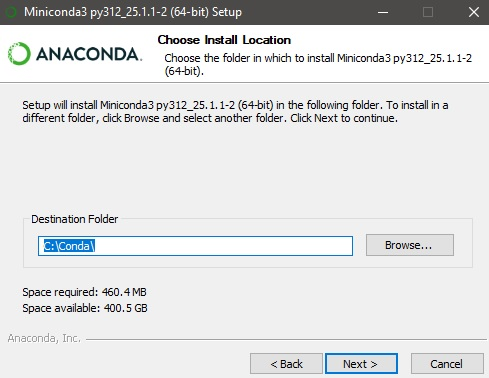

5. Al llegar a esta ventana, activar todas las opciones. 

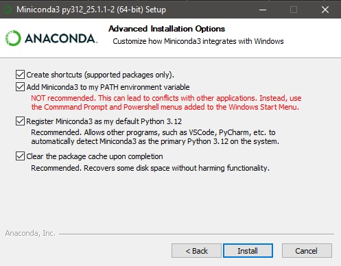

Estas opciones son importante por las siguientes razones:
* La primera opción crea el acceso directo en el menu de inicio de Windows a el cmd y el Powershell que inician conda.
* La segunda opción permite que VS Code y otros editores detecten automáticamente los entornos de desarrollo que vamos a crear. Si la advertencia causa mucho "ruido", puede desactivarse pero iniciar los entornos de conda requiere hacerse manualmente. Esta opción es útil si se tiene otro software, como Blender, que necesite su propia versión de Python.
* Detecta la versión del entorno base como la default del sistema.
* La cuarta opción libera el cache después de la instalación, muy útil si se esta experimentando y se reinstala Miniconda o Anaconda varias veces por cualquier razón.

6. Continuar y dejar que la instalación termine, cerrar la ventana de instalación desactivando las opciones finales que solo son un pequeño tour de conda.

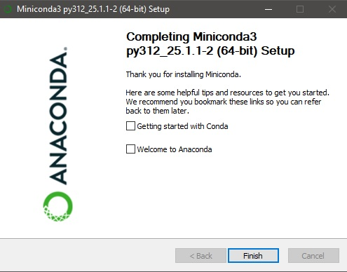

7. Para comprobar que todo este en orden, iniciar el Powershell de conda desde el menú de inicio

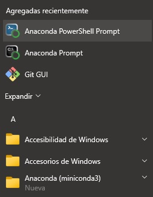

8. Checar que en efecto todo este correcto ejecutando Python en este Powershell y corriendo alguna línea sencilla

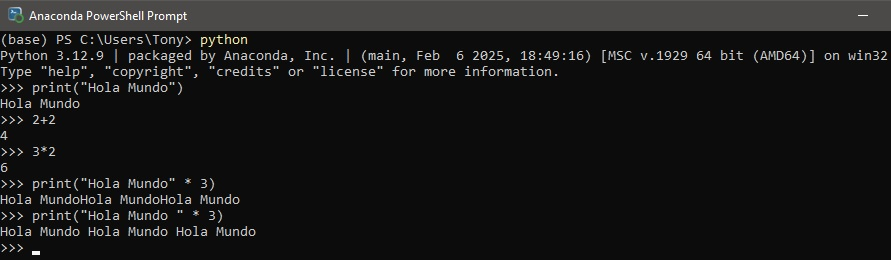

### Para distribuciones Linux

1. Descargar el instalador de línea de comandos (el primero para la gran mayoría de usuarios) 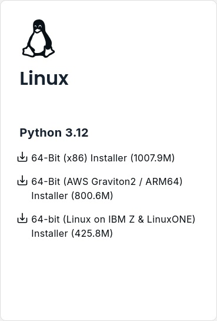

## Git

Git es el software de control de versiones de proyectos más comúnmente empleado, con una gran compatibilidad de software de terceros que van desde los repositorios en línea como GitHub, GitLab y Azure, y editores de texto como VS Code o PyCharm. 

Veremos como instalarlo tanto para Windows como Distribuciones Linux

### Para Windows

1. Descargar el instalador (de 64 bits para la mayoría de los usuarios) del link [Git Descarga](https://git-scm.com/downloads/win) 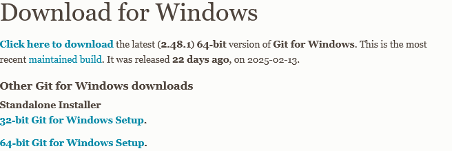}

2. Una vez descargado se ejecuta el instalador

